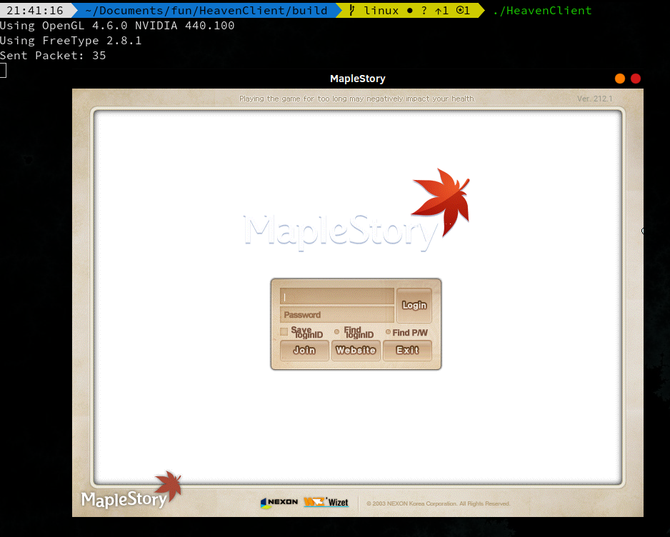
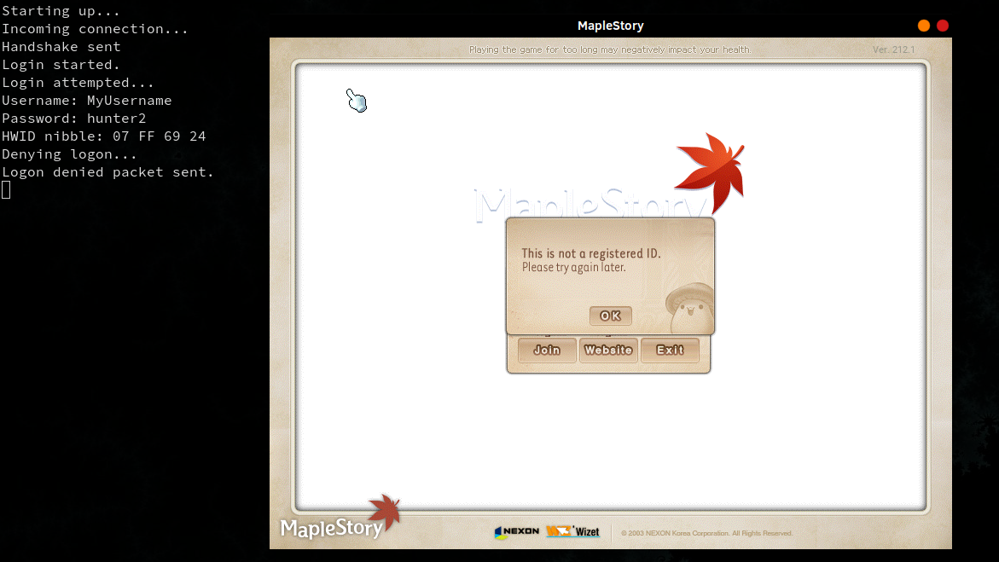

# RustMS 🍁
RustMS is an attempt at implementing the Maplestory server end from scratch in Rust. 

It's very work-in-progress and really only a few millimeters off the ground at this point, but it's been a fun evening/weekend side project so far!  

## Motivation
The motivation behind this project is two-fold:

When I started this project, I knew next to no Rust, however I was quite interested in learning it due to a general interest that I've always had in lower level languages. I've previously learned a bit of C, however I've only really used it in an academic setting (as well as to make this relatively bland [shell](https://github.com/neeerp/myShell) I made for fun). I thought Rust sounded interesting so I decided to start a fun project as a means of learning it. I'd also been trying to learn Vim for a while and thought caging myself in with it for this project (initially via the VS Code plugin and later neovim alone) would be fun.

The second motivation behind this project comes from the fact that Maplestory has a special place in my heart as the game that probably defined my childhood. I knew people had written and ran their own servers before but for the longest time it hadn't hit me that a lot of these servers had their source up on Github. Having looked at a few servers such as [HeavenMS](https://github.com/ronancpl/HeavenMS) and [Valhalla](https://github.com/Hucaru/Valhalla), I realized that I could probably try my hand at writing my own server too and that I could probably have quite a bit of fun with it.

## Overview
As of 09/08/2020, RustMS is still in very early stages.

The library for handling the encryption and decryption of packets is functionally complete, with support for Maplestory's custom approach to AES as well as its custom secondary "encryption" that gets applied before the AES encryption.

The library that models packets is functional in that a model exists for the packets with read/write capabilities have been implemented for a number of data types that Maplestory uses including bytes, byte arrays, Little Endian integers of various lengths, and length headered Strings.

The network library currently has a very basic model of the client session (where most of the magic happens, for now), a module for accepting and decrypting incoming packets from a session's TCP stream, and a very rough module for defining packet handlers.

The entry point of the project is the rust-ms-login module, which listens on `localhost:8484` and delegates incoming connections to new threads that it spawns.

As for overall functionality, you can only really handshake with the server and send it login attempt packets. The current goal at this point in time is to get the network infrastructure and packet model to a slightly more comfortable to work with state (i.e. implement a cleaner framework for handlers, make packet reading/writing seekable, add better error handling). After this, the focus will shift to the login flow, which will include adding a lot of handlers and hooking up a database! That'd also be a good time to Dockerize the project. Ideally I'll write out a more formal Roadmap section for this README sometime in the near future (if you're reading this, that either hasn't happened yet, or I forgot to remove this blurb...).

**TLDR**: *Quite a bit of basic infrastructure so far - we can actually understand the data the client sends, parse it, and echo it in the console! More infrastructure work to come and then hopefully login/account creation!*

## Demonstration
### Running the server
If you would like to run RustMS, clone the repository and run the project from the root with `cargo run` (make sure you have Rust and Cargo installed). You should see something akin to the following: 

On the first run of the server, you will likely have more output as dependencies will need to be downloaded and the project itself will build.

### Running the client
The server on its own is not particularly interesting without a client to communicate with it. At this point in time, this server is being developed with the [Heaven Client](https://github.com/HeavenClient/HeavenClient) in mind, however in theory any V83 Maplestory client that's pointed at `localhost` should work (no promises). Clone HeavenClient and follow the README's instructions on the branch corresponding to your operating system. Note that RustMS supports encryption and hence you shouldn't disable it when building the client.

Once you've built the client, run it:

In the server's console, you should see that the handshake completed successfully and the Login Start packet was received.

### Logging in
At the time of writing this, you can type in a username and password in the client's login window and submit. The server will parse the packet and echo it in the console.

## Roadmap
- [X] Develop a library for encrypting and decrypting packets in the form that the client expects
- [X] Develop a model for packets and packet IO
- [X] Develop basic infrastructure for sending and receiving packets to/from the client
- [X] Hook up a containerized database
- [X] Implement proper login and account creation flow
- [X] Implement character creation
- [ ] Revise and update roadmap
